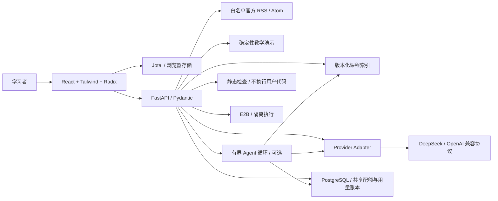

# 架构与运行边界

学习内容由 FastAPI 提供，React 负责可访问交互，Jotai 保存当前设备的个人学习记录。

## 功能与数据

两条路线各 24 节课，每条路线 8 个阶段。课程不强制解锁，完成标记要求通过测验与用户验收确认。实际学习位置、个人笔记、收藏与最近 20 次运行保存在 `deep-ai-station:v1`，导入时校验版本和结构。可选 `resume` 按路线保存最后课时与规范 ISO 时间，并显式记录最后路线；相同时间或设备时钟倒退不改变访问顺序。未知或路线不匹配的课时只影响恢复入口，不丢弃其他学习记录。旧备份无位置时推荐未完成课；实际访问不自动完成课程或语言实践。

信息流与收藏通过[精选资料关联表](learning-links.md)连接课程。关联只接受明确的资料 ID、原始 URL、路线和 guide 类型，同时验证当前课表和语言；RSS 不自动推断。全栈语言写入课程链接，Agent 入口固定 Python，Jotai 公共前端保留服务端偏好。关联本身不写学习数据，访问课程只更新原学习位置及显式选择的语言。

课程内容位于 `backend/curriculum.py`，专属测验与参考代码分别位于 `backend/quizzes.py`、`backend/examples.py`、`backend/fullstack_examples.py`。48 节课共 96 份专属示例：Agent 24 份 Python，全栈 24 份 Python、24 份 TypeScript、24 份 Go。修改课程需检查 ID 唯一性、阶段引用、官方链接与三语言语法。

React 界面统一使用 TypeScript；Go/Python 对应服务契约与工程机制。TS 示例覆盖 Hono、React、Jotai，Go 包含 net/http 与 Gin，Python 包含 FastAPI、Pydantic。片段中的 Provider / Repository / Database 接口由调用方注入；框架依赖与数据库驱动须在独立练习项目安装。

CI 对 48 份 Python 参考做 AST 校验，对 24 份 TS 参考做严格类型检查，对 24 份 Go 参考做只编译验证。Hono 4.13.12 固定在前端开发依赖，Gin v1.12.0 及其间接依赖固定在 `scripts/go-reference/go.mod` / `go.sum`；Go 使用 `test -c -mod=readonly`，不执行参考程序、测试或学习者输入。类型与编译通过不能代替运行与业务验收。

路由与输入校验两课提供 [独立 API 契约实验](../labs/README.md)，包含 FastAPI / Hono / Gin 的路由、服务与可注入 Repository。共享固定资料、严格输入规则和 HTTP 案例；语言差异由共同测试约束。`scripts/build_course_labs.py` 使用文件白名单生成确定性 ZIP（包括包内格式配置），`scripts/verify_course_labs.py` 在仓库外冻结安装、测试并实际启动每个语言服务，禁用回环请求代理，使用独立临时端口并释放自有进程。CI 分语言运行这些检查，静态 ZIP 随前端发布，实验源文件及依赖排除在 Python Function 之外。平台不会启动这些服务，也不执行学习者修改后的代码。

数据建模与迁移两课增加独立 SQLite 仓储实验（Python sqlite3 / Node node:sqlite / Go modernc SQLite），共用版本化 SQL 和 CLI 契约。显式迁移、组合唯一约束、参数化 SQL、事务内进度与审计写入、owner 范围及 keyset 分页均在真实数据库运行。CLI 的 owner 是可信调用方教学输入，不包含登录认证；时钟也是显式输入，不承诺迟到事件排序。`scripts/verify_sqlite_labs.py` 在仓库外逐命令启动新进程，验证保存、迁移保留、未来版本拒绝，以及审计/回填故障时的回滚。数据库与事务旁文件只留练习环境。

认证与应用安全两课提供独立会话授权实验，三语言共享公开假会话与84个HTTP案例。SessionStore构建可信Principal，Repository按服务端owner查找/更新；不同身份不共用记录。Cookie写操作同时验证精确Origin和会话绑定CSRF，凭据混用/重复拒绝。正文读取不持全局锁，正文完成后重检过期/撤销，避免长请求继续使用失效身份。资料owner检查/权限/更新为原子操作；最终准入后的在途操作仍可能完成。实验只在回环运行，重启重置假会话；没有生产登录、持久撤销或完整身份提供商。`scripts/verify_session_labs.py` 在独立包实际启动服务检查原始重复头与重启，Go同时运行race检测；HTTPS浏览器Cookie行为单独验收。

文档问答课增加独立受限文本上传实验，只接收原始 UTF-8 `.txt` / `.md`。显式假 Bearer 提供服务端身份，正文按实际字节限制4096；严格文件名仅作元数据，服务端ID作为私有对象键。仓储在同一个短原子操作内检查每owner三份/8192字节配额并发布元数据和不可变内容；失败不留记录或消耗ID，正文完成后重检会话。下载强制attachment、octet-stream、nosniff和no-store，不渲染或解析内容。78个共同HTTP案例覆盖字节/类型/文件名、身份、隔离、配额和同名不覆盖；独立包重启清空数据。实验不落盘，不代表生产文件系统、持久存储、复杂解析器或RAG已经完成。详细边界见[上传契约](../labs/text-upload/shared/CONTRACT.md)。

流式与异步两课增加[独立 SSE 实验](../labs/sse-stream/shared/README.md)，三语言后端共用 start/delta/done/error 协议与固定文本，每请求独立 Producer、运行ID及单个总deadline。真实HTTP断连测试观察取消和一次清理；Python额外保证异步清理开始后收到取消仍完成清理。共享React客户端使用增量UTF-8解码、完整事件解析、序号/身份/终态校验、字节/事件上限与重跑隔离，失败保留已有文字。下载包包含客户端源码和锁文件；`verify_stream_labs.py --browser` 在仓库之外验证各后端与客户端，仍不执行学习者输入或证明生产部署生命周期。

Agent 工具安全课增加 [独立审批与幂等实验](../labs/agent-write-safety/shared/CONTRACT.md)：服务端公开教学身份按 owner / requester / capability 授权，批准绑定不可变目标、全文、预期版本与摘要；正文读取及数据库锁后重检会话。SQLite 同一事务更新文档、唯一发布回执与 applied 状态，同操作重放只读原回执；提交后返回丢失标记为结果不明，保留原 ID 查询恢复。React 在切身份时清除旧数据并拒绝迟到响应，改草稿后需重新审核。实际平台 Agent 工具目录继续只读；ZIP 的本地教学写入不授予外部写工具权限。审批与回执持久化，教学会话重启重置，外部系统不在 SQLite 事务内。

全栈毕业阶段额外提供三个可运行的 [完整项目骨架](../starters/README.md)。它们共用 React / Tailwind / Jotai / Radix 前端和 15 组接口案例，分别连接 FastAPI、Hono 或 Gin；固定公开资料集与只读检索不接受上传或任意外部 URL。默认演示无模型调用，真实模式只使用服务端 DeepSeek adapter；账号、数据库、上传与生产发布留给毕业实践。只把固定文件白名单打入可复现 ZIP，并由 CI 比对源码与下载包、运行后端契约与 headless React → API 链路。平台 API 不启动这些项目或执行学习者修改。

Agent 毕业阶段提供独立的 [研究助手骨架](../starters/agent/README.md)，与课程导师的流式循环分开交付。两个只读工具只搜索和批量读取固定本地语料；服务端记录实际已读 ID，最终引用必须匹配已读正文摘录。三篇维护者课程摘录附官方延伸阅读链接，两篇合成冲突练习无外链，运行时不访问这些网页。已知冲突由语料元数据标注并要求引用两侧；它不是通用语义冲突检测，引用存在性通过也不能证明答案完全正确。最多三次模型请求、两次工具请求、20 秒总时限，逐次请求计入实例限额；用量缺失明确保留未知。教学演示和 mock 协议验证不代表真实模型或生产验收。

研究助手通过 DeepSeek 的 OpenAI 兼容 `messages` / `tool_calls` 完成工具循环，最终报告使用 `response_format: {"type": "json_object"}`，随后由本地 Pydantic 校验字段、实际已读 ID 与正文摘录。标准端点不发送 strict beta 或 `parallel_tool_calls` 字段；服务端自行拒绝同轮多个工具调用。

实时收藏保存来源、标题与摘要快照，订阅源失效后仍可回看；新收藏上限 200 条。旧版只含 ID 的记录仍兼容，重新收藏可补齐快照。资讯标识由稳定 URL 的摘要生成，源排序变化不会重复收藏。

信息流精选资料不伪造发布日期。订阅源固定为 OpenAI、LangChain、Hugging Face Blog、TypeScript、Go 与 Python；Hugging Face Blog 包含机构与社区作者的原文。请求不跟随任意重定向，内容上限 1 MB，XML 用 defusedxml 解析，文章 URL 必须属于对应来源域名。成功缓存 5 分钟，失败等待 1 分钟再尝试；源失效时保留已有内容，并明确标识保留缓存，界面从响应读取实际来源数量。

## Playground

免费检索评测由 `POST /api/playground/retrieval-evaluation` 提供，只接受路线与两套标题/加权策略、1–5 的整数 top-k，不接收任意问题、语料、URL、模型配置或代码。每条路线的固定开发集含 10 个正例与 2 个无证据例；相关课时为开发时预设的教学标签，尚未经独立人工审核，不随检索结果生成。标题策略每词命中计 1 分，加权策略延续现有课程检索：每词只取标题 4、目标 2、正文 1 中的最高分；同分保持课程顺序。

正例分别计算 Precision@k（命中数 / k，返回不足 k 条也保持该分母）、Recall@k（命中数 / 标注相关数）和首个相关排名的倒数，再取宏平均；负例仅统计返回空结果的比例。界面保留每题实际课时、分数、匹配词、漏检与误召回。报告带数据集版本、检索字段和排序顺序的 SHA-256、run_id、两套配置与零模型调用标记，可导出 JSON。完整报告留在当前组件会话，配置变更清除旧结果，切路线/课程/模式取消旧请求。有效课程中的成功评测可将版本、实际 A/B 配置与指标、学习者填写的观察和下一步追加到该课程笔记；原文保留，按精确运行标记防重复，最多 10,000 字符，沿用 v1 备份。个人判断最多 2,000 字符，开始新评测或修改配置时清除，未保存内容不跨课程保留。保存时重新检查最新笔记容量和重复标记，其他标签页或导入更改笔记后界面重新判断；不写课程完成、语言实践或模型运行历史。这是词法检索开发实验，不能证明向量召回、答案正确性或未见样本质量。

教学演示执行输入校验、课程检索和资料整理，清楚标注未调用模型。真实调用必须通过访问码验证并获得共享请求准入，服务端仅使用 `DEEPSEEK_API_KEY` 与 `DEEPSEEK_MODEL`（默认 `deepseek-flash`），固定请求 `https://api.deepseek.com/chat/completions`。底层沿用 OpenAI 兼容 `messages`、`tool_calls` 和 Chat Completions SSE，将回答增量转发到界面，不等待整段回答生成。

平台的 [共享请求配额](shared-quota.md) 使用 PostgreSQL 短事务，对同一服务器 scope / resource 的固定分钟与 UTC 日窗口原子检查和加一。模型每轮准入，沙箱在本地运行槽内创建前准入；两类资源互不消耗。数据库故障、表未初始化或策略不一致返回固定 503，不自动重试或回退；已准入的失败与取消保留计数。运行时不执行 DDL，也不在持有数据库事务时请求供应商。能力接口只检查配置，不证明数据库连通。

应用向浏览器发出的 SSE 协议包含 `start`、`trace`、`delta`、`usage`、`error`、`done`。每个运行有 UUID，取消会关闭上游 HTTP 连接；供应商是否已经计费不能由取消推断。只有完整且未达到输出上限的完成事件写入历史；中途失败保留部分文本和已收到的用量快照，明确提示未完成；取消保留浏览器已接收值并标记不完整。usage 只使用 DeepSeek 返回的已知计数字段，未返回时显示未知。快照按每轮最新值汇总，前端覆盖而不相加；只有所有已开始请求返回完整计数并正常结束，终态 `usage_complete` 才为真。协议与验证边界见 [流式用量](stream-usage.md)。

[模型请求账本](model-usage.md)按 `(scope, run_id, request_index)` 保存逐轮记录，与请求配额原子准入；供应商快照按序列替换，终态不可变。客户端断开不等于供应商没有消耗，无法确认终态的 `admitted` 行保留未知；UTC 日维护 CLI 汇总已知值与缺失数，不保存 prompt、回答或凭据。供应商流和客户端都结束后才记录完成；写入失败停止下一轮，取消清理有界且不补发 SSE。

每轮模型输出上限 1200 tokens，完整实验 45 秒、单帧 64 KiB、每轮流总量 1 MB、实验可显示文本合计 20,000 字符；异常正文与 thinking deltas 不进入回答。终止帧缺失、非法 JSON、输出超限均返回固定错误，清理连接。以上由 MockTransport、暂停远端流和 headless UI 验证，尚未调用真实模型。

协议参考：[OpenAI function calling](https://developers.openai.com/api/docs/guides/function-calling)、[DeepSeek Chat Completions](https://api-docs.deepseek.com/api/create-chat-completion/)。

代码实验提供 AST / 文本静态检查，以及配置后的独立 E2B 运行。API 主机禁止 `exec` 或 `subprocess` 执行用户输入。运行网络关闭，限制时间、并发、输出与实例寿命，成功、失败、超时、取消都清理；清理未确认会明确报告。Go 使用预装编译器的受信模板。详情见 [隔离运行](sandbox.md)。当前仅用 mock 验证适配器与界面，真实服务仍待托管配置。

代码编辑由独立 Jotai 内存 atom 管理，以学习方向、课时和语言组成 key，最多保留最近编辑的 20 组。切换语言、页面内导航返回和模式切换保留修改，空字符串也视为用户编辑；恢复示例只清除当前组。编辑不写入 localStorage 或学习记录导出，刷新后清空；“下载当前代码”可保存准确内容和对应扩展名。修改代码立即清除旧检查/运行结果，运行中禁用编辑；全栈语言选择与课程偏好一致。

模型 Markdown 保留编号、项目符号与标题层级。原始 HTML 不执行；图片仅展示替代文字，不自动请求外部地址。链接仅允许不带认证信息的绝对 HTTPS URL，其余保留文字；模型内容不能通过图片地址或危险链接触发浏览器操作。

只读课程检索通过中文短语、双字片段与英文工程术语匹配课程标题和正文，无匹配时明确提示。默认工作流由服务端固定检索，再请求一次模型回答；可选 Agent 循环通过供应商原生协议让模型选择检索或阅读课程。工具仅能读取当前路线的版本化课程，没有外部网络、文件或代码执行权限。

有界循环最多 3 次模型请求和 2 次工具请求，最后一轮强制禁用工具；每轮调用前获得跨实例共享的模型请求准入，固定分钟 10 次、UTC 日 100 次。模型参数由 Pydantic 严格校验；未知工具、跨路线课时和非法参数返回错误观察，不执行操作。同参数只读请求复用当前运行结果，重复调用 ID、并行调用、未闭合或超过 4 KiB 的参数拒绝继续。教学演示保持固定检索 → 阅读 → 整理顺序，明确没有模型决策。详见 [Agent 工作流](agent-workflow.md)。

课程页可直接向导师提问。可选 `lesson_id` 必须存在且属于请求中的学习方向，在供应商授权前完成校验。默认检索把该课排在第一位，再补充至多两条同路线资料；课程目标、实践步骤和验收项全部从服务端索引读取。Agent 循环先向模型提供课时 ID 与标题，目标与验收细节通过 `lesson_read` 获取。教学演示展示本课实践计划，资料不能改变指令。

完整实验的历史记录可带 `lesson_id`，旧版无课时记录仍兼容。回看会恢复相应学习方向与课程。用户点击“写入本课笔记”后才追加回答，保留原有内容、实际运行任务和时间；同一个运行 ID 只追加一次，超过 10,000 字符则拒绝写入。未完成或截断的实验不能回写笔记，回答也不会改变课程完成标记。

历史还可保留工作流、至多 12 条轨迹、实际轮次/工具次数和已知用量。模型请求从运行中更新为完成或错误时沿用同一轨迹 ID，回看保留原状态；某轮未返回用量时显示“部分模型轮次未返回用量”，不估算缺失值或费用。导入限制轮次 1–3、工具次数 0–2 与用量计数字段，拒绝额外字段。

## 安全与部署

供应商密钥不进入前端，访问码仅保留页面内存，均不进入导出数据；上游错误返回固定类别，不回传第三方错误正文。Pydantic 拒绝额外参数并限制输入长度，ASGI 中间件按实际字节限制请求体，包含无 Content-Length 的分块传输。导入只允许已知字段与 HTTPS 资料链接，拒绝额外凭据字段和 URL 内的认证信息。真实模型准入通过 PostgreSQL 按稳定 scope 跨实例限制 10 次/分钟及 100 次/UTC 日，并原子创建逐轮账本；本地显式内存模式不提供跨实例保护。

Vercel 使用静态构建与 Python Function。同域 `/api/*` 路由进入 FastAPI，其余路径走 SPA。GitHub Actions 检查依赖冻结、格式、类型、测试与构建。发布后必须检查 `/api/health` 与浏览器核心流程。

Vite 框架构建与 `functions` 配置共同使用，避免 `builds` / `functions` 冲突；Python 函数排除前端依赖与开发资料，保留后端课程源文件。[Vercel 配置冲突说明](https://vercel.com/docs/errors/error-list#conflicting-functions-and-builds-configuration)。

生产集成参考：[Vercel Python Runtime](https://vercel.com/docs/functions/runtimes/python)、[FastAPI](https://fastapi.tiangolo.com/)、[Jotai Storage](https://jotai.org/docs/utilities/storage)、[shadcn/ui](https://ui.shadcn.com/docs)。

## 按课时和语言记录实践证据

九节可运行实验课与六节毕业课的[证据卡](practice-evidence.md)按 lesson_id 与 language 分别保存于原 version 1 学习记录的可选 evidence 数组；旧备份无该字段仍可导入。Agent 固定 Python，全栈沿用所选语言。最多 48 条记录（共用单一容量常量），代码版本最多 200 字符，命令、成功/失败结果和未验证事项各 2000 字符；拒绝额外字段、重复组合和非法时间。

保存前读取最新有效存储并只更新对应字段；本地写入失败时保留内存，迟到 storage 事件重新读取当前存储，不回退到旧事件载荷。清空五个内容字段移除当前记录，释放容量；未填写的新记录不占位。它不提供跨标签事务，真正同时写入仍可能由最后写入覆盖。保存不更改笔记、测验或完成状态；存储失败仍通过全局提示要求备份。Markdown 导出以动态长度文本围栏包住填写内容，防止用户文本逃逸成 HTML 或其他 Markdown 结构，并注明未经平台核验。实验 Markdown 额外标注实验名称，毕业标题保持兼容。JSON 导入仍限 2,000,000 字节；完整导出超过该限制时明确提示不能直接导回，不静默截断，也不改当前记录。该功能不上传云端、不调用模型；只保存学习者手动填写的实际证据，禁止填写密钥或访问码。

## 按语言记录实践

原 `completed` 继续表示共同课程完成。可选 `practice` 数组按 `lesson_id` / `language` 保存首次自行确认的 `completed_at`，不从完成课时、当前语言、下载操作或证据内容推断实践。全栈三个语言分别记录，Agent 仅 Python；课程页要求单独勾选成功/失败样例确认，切课时或语言后清除未提交确认，撤销只删除对应实践组合。路线页仅统计当前课程集合，实践数不会累加到课程完成百分比。

学习记录保持 version 1 和原存储键；旧备份缺省实践为空，导入整体替换前明确告知该语义。兼容方向为旧备份导入新版；含 `practice` 的备份不能导入尚未支持此字段的旧版本。每条实践精确允许课程 ID、语言和规范 ISO 时间三个字段，最多256条，拒绝额外字段、重复组合、非法时间/语言及Agent非Python。重复保存保持首次时间；满额仍可撤销。所有导入先完整校验再写入，错误文件不修改当前数据。

实践记录是学习者的自我确认，不代表平台执行、审核或认证，也不自动完成课时。它和笔记、毕业证据及运行历史独立，只保存在浏览器并随原JSON备份导出；存储失败沿用全局备份提示。

## 工具契约实验

[免费工具契约实验](tool-contract.md)使用独立JSON接口复用现有TOOLS与execute_tool，仅开放两个Agent课时和两个公开课程只读工具。外层归属课与工具参数中的读取课区分；参数原文在UTF-8字节限制内严格解析，重复键与非有限数拒绝，随后复用Pydantic参数模型。教学拒绝返回稳定observation，内部异常固定脱敏500，不调用供应商、配额或沙箱。

前端对版本、请求四字段、运行ID、operation_id及结果结构做校验，不用JavaScript空白规则重新判定Python业务结果。组件按路线/课时重建，停止/编辑/卸载先使请求失效；目录与执行各有15秒等待上限，迟到响应不能覆盖重试。保存通过Jotai functional updater重检当前笔记与容量，沿用v1备份，不改变完成、语言实践或模型历史。

## 测验检查与回顾

[测验回顾](quiz-review.md)作为 Progress version 1 的可选 quizReview 保存课时ID与首次加入UTC时间，最多64条。严格结构与日期校验，保留当前目录不可用的合法记录；解析入口时跨整个目录检查ID唯一性和路线归属。检查/移除在functional updater内读取最新有效存储，仅替换该字段。

课时选择与检查结果仅在页面内存中，完整题目内容构成身份；身份变更既同步屏蔽旧结果，也清空状态，A→B→A不会恢复通过资格。未完成课需显式检查答对及全部验收确认才可手动完成，既有完成不迁移。测试专用React入口在tests/fixtures中，只由Vite开发测试使用，不加入生产构建。
