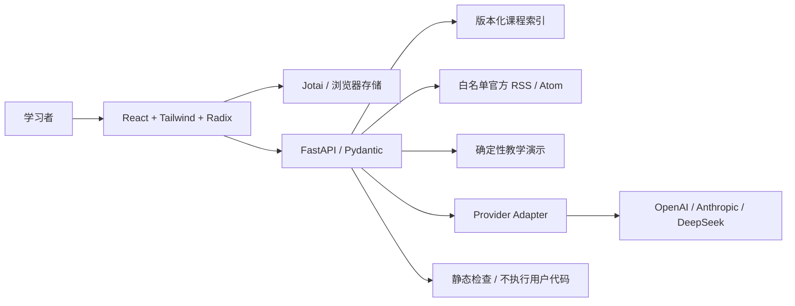

# 架构与运行边界

学习内容由 FastAPI 提供，React 负责可访问交互，Jotai 保存当前设备的个人学习记录。

## 功能与数据

两条路线各 24 节课，每条路线 8 个阶段。课程不强制解锁，完成标记要求通过测验与用户验收确认。个人笔记、收藏与最近 20 次运行保存在 `deep-ai-station:v1`，导入时校验版本和结构。

课程内容位于 `backend/curriculum.py`，专属测验与参考代码分别位于 `backend/quizzes.py`、`backend/examples.py`、`backend/fullstack_examples.py`。48 节课共 96 份专属示例：Agent 24 份 Python，全栈 24 份 Python、24 份 TypeScript、24 份 Go。修改课程需检查 ID 唯一性、阶段引用、官方链接与三语言语法。

React 界面统一使用 TypeScript；Go/Python 对应服务契约与工程机制。TS 示例覆盖 Hono、React、Jotai，Go 包含 net/http 与 Gin，Python 包含 FastAPI、Pydantic。片段中的 Provider / Repository / Database 接口由调用方注入；框架依赖与数据库驱动须在独立练习项目安装。

CI 对 48 份 Python 参考做 AST 校验，对 24 份 TS 参考做严格类型检查，对 24 份 Go 参考做只编译验证。Hono 4.13.12 固定在前端开发依赖，Gin v1.12.0 及其间接依赖固定在 `scripts/go-reference/go.mod` / `go.sum`；Go 使用 `test -c -mod=readonly`，不执行参考程序、测试或学习者输入。类型与编译通过不能代替运行与业务验收。

实时收藏保存来源、标题与摘要快照，订阅源失效后仍可回看；新收藏上限 200 条。旧版只含 ID 的记录仍兼容，重新收藏可补齐快照。资讯标识由稳定 URL 的摘要生成，源排序变化不会重复收藏。

信息流精选资料不伪造发布日期。订阅源固定为 OpenAI、LangChain、Hugging Face Blog、TypeScript、Go 与 Python；Hugging Face Blog 包含机构与社区作者的原文。请求不跟随任意重定向，内容上限 1 MB，XML 用 defusedxml 解析，文章 URL 必须属于对应来源域名。成功缓存 5 分钟，失败等待 1 分钟再尝试；源失效时保留已有内容，并明确标识保留缓存，界面从响应读取实际来源数量。

## Playground

教学演示执行输入校验、课程检索和资料整理，清楚标注未调用模型。真实调用使用服务端 provider 配置，必须通过访问码验证；OpenAI / DeepSeek 的 Chat Completions SSE 与 Anthropic Messages SSE 原生增量转发到界面，不等待整段回答生成。

SSE 协议包含 `start`、`trace`、`delta`、`error`、`done`。每个运行有 UUID，取消会关闭上游 HTTP 连接；供应商是否已经计费不能由取消推断。只有完整且未达到输出上限的完成事件写入历史；中途失败保留部分文本，明确提示未完成。usage 只使用供应商返回的已知计数字段，Anthropic 累积用量按最新值合并，未返回时显示未知。

模型输出上限 1200 tokens，完整请求 45 秒、单帧 64 KiB、流总量 1 MB、可显示文本 20,000 字符；异常正文与 thinking deltas 不进入回答。终止帧缺失、非法 JSON、输出超限均返回固定错误，清理连接。以上由 MockTransport、暂停远端流和 headless UI 验证，尚未调用真实模型。

协议参考：[OpenAI Streaming](https://developers.openai.com/api/docs/guides/streaming-responses)、[Claude Streaming](https://platform.claude.com/docs/en/build-with-claude/streaming)、[DeepSeek Chat Completions](https://api-docs.deepseek.com/api/create-chat-completion/)。

代码实验提供 AST / 文本静态检查，以及配置后的独立 E2B 运行。API 主机禁止 `exec` 或 `subprocess` 执行用户输入。运行网络关闭，限制时间、并发、输出与实例寿命，成功、失败、超时、取消都清理；清理未确认会明确报告。Go 使用预装编译器的受信模板。详情见 [隔离运行](sandbox.md)。当前仅用 mock 验证适配器与界面，真实服务仍待托管配置。

教学演示与真实模型共用只读课程检索：中文短语、双字片段与英文工程术语匹配课程标题和正文；无匹配时明确提示。真实模型只收到本次检索的课程证据与来源，资料不能授予工具权限。当前是固定检索工作流，不宣称模型自主决定任意外部工具调用。

## 安全与部署

密钥与访问码不进入前端、不进入导出数据；上游错误返回固定类别，不回传第三方错误正文。Pydantic 拒绝额外参数并限制输入长度，ASGI 中间件按实际字节限制请求体，包含无 Content-Length 的分块传输。导入只允许已知字段与 HTTPS 资料链接，拒绝额外凭据字段和 URL 内的认证信息。当前模型限流为单实例 10 次/分钟，横向扩展需要共享配额。

Vercel 使用静态构建与 Python Function。同域 `/api/*` 路由进入 FastAPI，其余路径走 SPA。GitHub Actions 检查依赖冻结、格式、类型、测试与构建。发布后必须检查 `/api/health` 与浏览器核心流程。

Vite 框架构建与 `functions` 配置共同使用，避免 `builds` / `functions` 冲突；Python 函数排除前端依赖与开发资料，保留后端课程源文件。[Vercel 配置冲突说明](https://vercel.com/docs/errors/error-list#conflicting-functions-and-builds-configuration)。

生产集成参考：[Vercel Python Runtime](https://vercel.com/docs/functions/runtimes/python)、[FastAPI](https://fastapi.tiangolo.com/)、[Jotai Storage](https://jotai.org/docs/utilities/storage)、[shadcn/ui](https://ui.shadcn.com/docs)。
