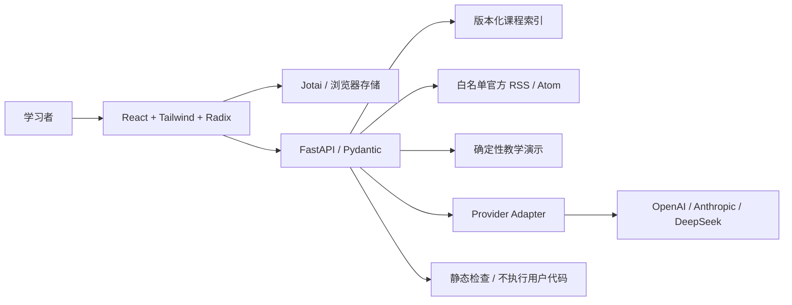

# 架构与运行边界

学习内容由 FastAPI 提供，React 负责可访问交互，Jotai 保存当前设备的个人学习记录。

## 功能与数据

两条路线各 24 节课，每条路线 8 个阶段。课程不强制解锁，完成标记要求通过测验与用户验收确认。个人笔记、收藏与最近 20 次运行保存在 `deep-ai-station:v1`，导入时校验版本和结构。

课程内容位于 `backend/curriculum.py`。修改课程需检查 ID 唯一性、阶段引用、官方链接与 Python 示例语法。当前参考代码是路线基础骨架，实践目标要求学员扩展；后续迭代会增加逐课专用实验。

信息流精选资料不伪造发布日期。实时源固定为 OpenAI、LangChain、TypeScript、Go 与 Python，请求不跟随任意重定向，内容上限 1 MB，XML 用 defusedxml 解析，文章 URL 必须属于对应官方域名。源失败保留已有缓存或精选资料，状态独立展示。

## Playground

教学演示执行输入校验、课程检索和资料整理，清楚标注未调用模型。真实调用使用服务端 provider 配置，必须通过访问码验证；模型响应完成后逐段发送给界面，目前不宣称供应商原生 token streaming。

SSE 协议包含 `start`、`trace`、`delta`、`error`、`done`。每个运行有 UUID，客户端支持取消，只有完成事件写入历史。usage 只使用供应商真实返回值，不把估算当实际用量。

代码实验仅使用 AST 或文本结构检查，不运行代码、不证明业务正确。API 主机禁止 `exec` 或 `subprocess` 执行用户输入。隔离代码运行需独立沙箱、资源上限、输出截断和销毁流程，列入下一轮功能。

## 安全与部署

密钥与访问码不进入前端、不进入导出数据；上游错误返回固定类别，不回传第三方错误正文。Pydantic 拒绝额外参数并限制输入长度。当前模型限流为单实例 10 次/分钟，横向扩展需要共享配额。

Vercel 使用静态构建与 Python Function。同域 `/api/*` 路由进入 FastAPI，其余路径走 SPA。GitHub Actions 检查依赖冻结、格式、类型、测试与构建。发布后必须检查 `/api/health` 与浏览器核心流程。

生产集成参考：[Vercel Python Runtime](https://vercel.com/docs/functions/runtimes/python)、[FastAPI](https://fastapi.tiangolo.com/)、[Jotai Storage](https://jotai.org/docs/utilities/storage)、[shadcn/ui](https://ui.shadcn.com/docs)。
