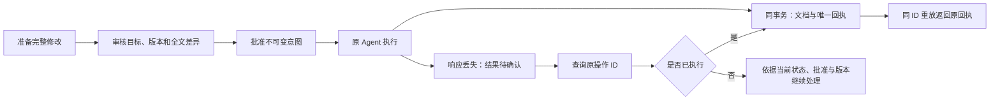

# 工具的写入需要可核对的批准

本实验对应 Agent「工具安全」课：FastAPI 准备不可变修改，React 展示完整差异，教学审批者批准后，原 Agent 才能把新版本写入 SQLite。它只修改本地教学文档，没有外部发布、真实模型或生产权限。平台仅提供下载，不运行学习者修改的代码。



## 启动

需要 Python 3.12 / uv、Node.js 24 / pnpm 10.32.1。首次冻结安装需要网络。在解压根目录执行：

```sh
uv sync --locked
uv run --frozen ruff check .
uv run --frozen ruff format --check .
uv run --frozen pytest -q
uv run --frozen python app.py --db lab.db --port 8042
```

保持后端运行，在另一个终端进入 `client/`：

```sh
pnpm install --frozen-lockfile
pnpm check
pnpm dev
```

打开 `http://127.0.0.1:5196`。服务只监听 `127.0.0.1`；Vite 的 `/api` 固定转发本地 8042。更换端口时后端使用 `--port`，客户端使用 `LAB_API_PORT=端口 pnpm dev`，只能配置本地数字端口。结束后停止自己的两个进程并核对监听释放。

仓库内学习时，后端在 `labs/agent-write-safety/python/`，客户端在 `../shared/client/`；共享资料在 `../shared/`。ZIP 已把共享文件放在根目录。数据库与其事务旁文件已忽略，不要提交或上传。

## 完成一次可审查的写入

1. 选择 Alice Agent 教学身份，读取 `agent-summary`，修改正文并准备操作。新操作 ID 只由显式创建产生。
2. 切换到 Alice 审批者，查询原操作，核对目标、预期版本、修改前后全文、原 requester 与摘要后批准。
3. 切回 Alice Agent，查询同一操作并执行。服务端在同一 SQLite 事务里检查身份、批准和当前版本，更新文档、写入唯一回执并标记 applied。
4. 重放同一操作只返回原回执，版本不再增加。重启后仍能查询原回执。相同 ID 搭配不同参数会被拒绝。
5. 另建两个基于同一版本的操作并分别批准：只有一个可以成功执行。改变草稿后需要新的审核，不能把旧批准用于新内容。

所有身份选项来自公开、无生产权限的 `fixtures.json`。同 owner 的审批者可以审阅，另一个 Agent 可以读取；只有原 requester 能执行。Bob 不得读取 Alice 的文档或操作。真实服务不能把这些固定 token 当作登录系统。

## 检查失败和结果不明

批准默认 60 秒到期；重复批准不会延长，撤销或被服务端观察到的过期不能恢复。批准不等于保证执行，文档版本可能在执行前变化。摘要标识意图，不是凭据，必须审核实际内容。

停止原后端后，可用同一数据库启动固定故障：

```sh
uv run --frozen python app.py --db lab.db --port 8042 --fault-after-commit
```

新操作首次执行会真实提交后返回 `503 result_unconfirmed`。保持原 ID 查询，再重放，确认只有一个发布记录。网络断连也可能发生在提交之后：不能看到错误就声称已回滚或自动用新 ID 重试。`--response-delay-ms 1000` 只延迟首次提交后的响应，用于真实 HTTP 断连测试，HTTP 本身不能控制故障或时钟。

客户端切换身份会中止旧请求并立即清除旧内容；迟到响应不能回填。操作 ID 只按 owner 在页面内存保留供查询，文档、会话、批准不写浏览器持久存储；刷新后可手动查询已保存的原 ID。失败记录是教学证据，不是生产环境验收。

## 边界与实现入口

[CONTRACT.md](CONTRACT.md) 是输入、权限、状态机、错误与事务的共同约定。`app.py` 负责有界 HTTP 输入与路由，`auth.py` 构建并重检服务端身份，`repository.py` 和 `migrations/001.sql` 实现真实事务及不可变约束。`test_app.py` 验证实际失败路径；`client/src/protocol.test.mjs` 检查响应和异步隔离。将命令和实际结果填写到 [EVIDENCE.md](EVIDENCE.md)，也可记录到课程页的实验实践证据卡。

数据库中的操作、批准与发布回执持久化；公开教学会话的过期/撤销状态在进程重启时重置。最后准入后发生的会话撤销不保证取消在途事务。SQLite 本地事务不覆盖外部系统；真实邮件、支付或第三方发布需独立设计服务端身份、外部幂等与对账恢复。实验不宣称生产身份、分布式撤销或跨系统 exactly-once 已验收。
