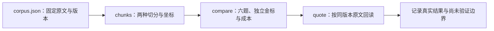

# Markdown 切分、检索与来源回读

本实验对应「文档切分与索引」课（`agent-chunking`）。用三份固定教学 Markdown 比较标题切分与重叠窗口，再沿来源版本和原文坐标回读证据。业务代码只使用 Python 3.12 标准库；实验只读包内资料，不需要模型、账号或密钥。



## 安装与检查

需要 Python 3.12 和 uv。在解包根目录执行；仓库源码入口是 `labs/document-chunking/python/`。首次安装开发依赖可能访问包仓库，三个实验命令不提供网络访问入口。

```sh
uv sync --frozen --python 3.12
uv run --frozen ruff check .
uv run --frozen ruff format --check .
uv run --frozen pytest -q
```

`uv.lock` 固定 pytest / Ruff 开发依赖；业务 CLI 也可由 Python 3.12 直接执行 `python app.py ...`。资产相对 `app.py` 定位，不从当前目录或用户给出的路径加载。以上是运行步骤，请记录实际退出码，不把文档当作已通过的测试日志。[uv 官方说明](https://docs.astral.sh/uv/concepts/projects/sync/)解释了冻结锁文件的同步行为。

## 完成一个学习闭环

1. 先阅读包内 `corpus.json` 和 `cases.json`。正文来自维护者教学摘录，含一组明确标注的合成冲突；URL 是背景参考，不是已抓取的官方网页全文。金标先按原文摘录确定，没有根据切分或排名反推。
2. 运行两种切分，观察 `text`、`header_path`、来源版本、块 ID 与两套坐标。标题元数据不拼进原文，也不额外参与打分。

   ```sh
   uv run --frozen python app.py chunks --strategy heading
   uv run --frozen python app.py chunks --strategy window --size 80 --overlap 16
   ```

3. 在相同词法打分和 `top_k` 下比较六题。查看每题两侧的结果块、指标、检索代码点数，以及 summary 中的索引与检索成本。

   ```sh
   uv run --frozen python app.py compare --size 80 --overlap 16 --top-k 2
   ```

   改为 `--size 128 --overlap 16` 或 `--top-k 3`，重新记录实际配置和结果。低召回仍是成功运行；不能为了提高分数改金标。标题块可能比窗口长，成本不同，不能只凭召回自动推荐某种策略。

4. 从命中复制 `source_id`、`source_revision` 和 `[start,end)`，用 `quote` 回读。核对块内证据与同版本原文相等；回读成功本身不证明该片段曾被检索，也不证明它能支持模型回答。
5. 做下方 Unicode 和失败练习，把实际命令、结果、版本与限制写入 [EVIDENCE.md](EVIDENCE.md)，或本课 Python 实践证据卡。下载、填写证据或得到比较报告，都不会自动确认课程和语言实践完成。

## 可直接回读的 Unicode 样本

```sh
uv run --frozen python app.py quote --source-id tool-evidence --revision sha256:bf6a09d8e98c52294f205f7f8063fc7c6b11596cce3e70c9926ec9d9cc3cd5c7 --start 172 --end 178
```

这段固定原文是 `A😀éZ。`：代码点区间 `[172,178)`，UTF-8 字节区间 `[442,454)`，分别长 6 个代码点和 12 bytes。`é` 是 `e` 加 U+0301，不是单个预组合字符。`tool-evidence` 保留 14 处 CRLF，每处占两个代码点；禁止换行或 Unicode 归一化后继续沿用旧坐标和哈希。

`start/end` 不是 JavaScript UTF-16 索引、视觉字形数量或 tokens。窗口可能切开组合字形；本实验保留代码点边界，不提供字形完整切分。字符与编码的区别见 [Python 3.12 Unicode HOWTO](https://docs.python.org/3.12/howto/unicode.html)。上述数值来自已核对的固定资产，不是一次虚构 CLI 运行日志。

## 失败也要观察

以下三条均应退出 1，stdout 只返回固定错误 JSON，stderr 为空；逐条运行并记下真实退出码。

```sh
# 形状合法但不是当前版本：revision_mismatch
uv run --frozen python app.py quote --source-id tool-evidence --revision sha256:0000000000000000000000000000000000000000000000000000000000000000 --start 172 --end 178
# 原文只有233个代码点：invalid_range
uv run --frozen python app.py quote --source-id tool-evidence --revision sha256:bf6a09d8e98c52294f205f7f8063fc7c6b11596cce3e70c9926ec9d9cc3cd5c7 --start 172 --end 234
# 重复参数不采用最后一个值：invalid_input
uv run --frozen python app.py compare --top-k 2 --top-k 3
```

空区间、未知来源、非法整数和资产损坏另见 [CONTRACT.md](CONTRACT.md)。帮助只接受 `python app.py --help` 或 `python app.py compare --help` 等合法子命令加独立 `--help`；夹带其他参数、重复 help、`-h` 都是 `invalid_input`。不要通过覆盖语料、重算金标或吞掉错误得到“成功零命中”。

## 如何解释指标

五个正例、一个负例，共六个独立证据区间。一个结果块完整包含同来源、同版本的整个金标区间，才算覆盖；两块各覆盖一半不能拼成一次完整命中。重叠块重复包含同一金标，召回只计一次；块精度可以把两个相关块分别计数，重复文字也分别计入成本。

- `evidence_recall_at_k`：唯一已覆盖证据数 / 该题证据数。冲突题必须保留两侧，只有一侧为 1/2。
- `chunk_precision_at_k`：相关结果块数 / 请求的 `top_k`；即使返回不足 k，分母仍为 k。
- `first_evidence_reciprocal_rank`：第一个完整证据块的排名倒数，无命中为 0。
- `no_result_accuracy`：仅负例适用，结果为空为 1，否则为 0。正例三指标与负例分别平均，不适用值为 null，不补零混算。

固定六题是教学开发集；受限 Markdown 子集、词法匹配和代码点成本不代表完整 CommonMark、向量检索、模型生成质量、生产 RAG 泛化质量或 token 预算。`model_calls: 0` 是本实验契约字段，实际无调用边界仍须由测试和独立验收核对。没有上传、任意文件路径、URL 抓取或自由查询入口。报告存入被忽略的 `artifacts/` / `reports/`，不要提交凭据、配置或日志。
