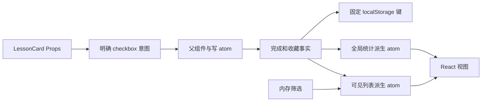

# 组件与派生状态实验

这是 `fullstack-components` 与 `fullstack-jotai` 共用的 TypeScript 前端实验。React 展示固定三张课程卡，Jotai 保存完成、收藏事实，并计算列表与统计。没有后端、模型请求或学员代码执行接口；勾选不会改变学习平台的课程完成、语言实践或证据记录。

## 启动与检查

使用 Node 24 和 pnpm 10.32.1，在解压后的包根目录运行：

```sh
pnpm install --frozen-lockfile
pnpm check
pnpm dev
```

开发页面是 `http://127.0.0.1:5198`。依赖安装可能联网；实验操作只处理本地固定数据。Vite 开发模式的热更新连接属于开发工具，不是业务 API。浏览器验收使用构建后的 preview，关闭热更新：

```sh
pnpm build
pnpm preview
```

两个命令都仅绑定 loopback，并要求端口空闲。需要不同端口时显式运行 `pnpm dev --port 5199` 或 `pnpm preview --port 5199`，结束后在自己启动的终端按 Ctrl+C。不要关闭无关服务。

## 沿数据流读源码

1. `src/LessonCard.tsx`：Props 决定标题、说明和 checkbox 状态；组件通过回调把 `event.target.checked` 传给父组件。卡片不读写 localStorage。
2. `src/App.tsx`：父组件把卡片 ID 与明确的 `true` / `false` 交给写 atom，并订阅只读事实与派生值。相同意图重复一次也不会反转状态。
3. `src/state.ts`：私有事实 atom 只保留 `completedIds` / `favoriteIds`；`visibleCardsAtom` 读取内存筛选，三个统计 atom 始终读取全部事实。完成率分母是三张卡，不是当前可见卡数。
4. 页面“事实与派生值”面板把两类数据并排展示。只有左侧事实会写入 `frontend-state-lab:v1`，右侧 JSON 是即时计算结果。



## 一次有对照的操作

1. 初始为三张卡、完成 0 / 3、收藏 0 / 3、完成率 0%。勾选第一卡“已完成”，预期完成 1 / 3，完成率 33%。
2. 收藏第二卡；切“未完成课程”，只剩第二、三卡，但完成率仍是 33%。切“收藏课程”，只剩第二卡，完成率也不变。用事实与派生 JSON 解释原因。
3. 取消第二卡收藏，当前筛选为空；点击“显示全部课程”回到三张卡。取消第一卡完成，再观察统计。
4. 再勾选一张卡并选择“收藏课程”，刷新页面：完成和收藏恢复，筛选回“全部课程”。用浏览器开发工具检查唯一实验键中没有计数、百分比或筛选字段。
5. 在 [EVIDENCE.md](EVIDENCE.md) 写实际操作、前后值和一个被证据纠正的假设，不要把这里的预期抄成已经通过的结果。

## 自己补一个派生值

初始版**没有实现**“已收藏且未完成”的统计。请在自己的独立副本中：

1. 从 `factsAtom` 新建只读派生 atom，计算两个集合的关系；不要新增持久化字段或在点击事件里手动维护计数。
2. 在统计区展示它。设计至少三个输入：只收藏、收藏且完成、撤销完成。
3. 补行为测试，证明筛选变化不会改变这个全局统计。
4. 记录实际结果、错误假设和未验证项。平台不会自动运行你的修改，也不会自动评分。

## 存储边界

只保存本 origin 的固定实验键。筛选、派生值不持久化；坏版本、额外字段、未知或重复 ID 整份不采用，先用空事实并提示。读写失败时继续使用本页内存，刷新可能丢失。下一次成功的明确事实操作可以覆盖旧记录。没有导入导出、跨标签同步、云同步或并发合并；不要用它存放真实学习记录或敏感内容。精确控件与状态合同见 [CONTRACT.md](CONTRACT.md)。
