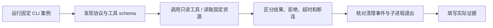

# 从发现工具到回收进程

本实验对应「MCP 客户端与服务端」课。官方 Python SDK 客户端启动包内固定服务端，两个进程通过 stdio 交换真实 MCP 消息；学习者观察发现、只读查询、资源读取、拒绝、超时取消和断连。无需模型、账号或密钥，也没有 HTTP 服务、浏览器客户端或远端服务器配置。



## 运行

需要 macOS / Linux（POSIX）、Python 3.12 与 uv；SDK 固定为 `mcp==2.3.0`，协议固定为 `2026-07-28`。首次冻结安装需要网络，实际案例不访问业务网络。在解压根目录执行：

```sh
uv sync --locked --python 3.12
uv run --frozen ruff check .
uv run --frozen ruff format --check .
uv run --frozen pytest -q
uv run --frozen python client.py
```

最后一条默认等价于 `--case all`，依次运行 `normal`、`errors`、`timeout`、`disconnect`，各自启动并回收一个固定服务端。客户端 stdout 输出机器可读 JSON 摘要，无需另开终端启动服务或填写端口。结束时检查 `passed` 和每个 run 的清理事实；不要只看到命令返回就填写“通过”。

仓库内学习时先进入 `labs/mcp-readonly/python/`；ZIP 将 Python 源码与共享说明放在同一根目录。平台只提供固定下载，不在应用主机运行学习者修改后的代码。请在独立练习环境完成自己的修改与验证。

## 按顺序完成学习闭环

1. 运行 `uv run --frozen python client.py --case normal`。找到实际 `server/discover`、采用的协议版本、`tools/list` 的输入 schema 与 `resources/list` 的三个 URI。这是当前固定版本的发现流程，不是旧协议的 `initialize` 握手。
2. 对照 `knowledge_search` 的 query / limit 约束，查看命中和空结果，再核对读取资源的完整文本。资源标识只对应包内固定知识，不是可打开的文件路径或网络地址。
3. 先预测非法参数、未知工具和未知资源会落在哪一层，再运行 `uv run --frozen python client.py --case errors`。区分 JSON-RPC 错误、工具 `isError` 和正常空结果；schema 或只读提示不能代替服务端校验与授权。
4. 运行 `uv run --frozen python client.py --case timeout`。核对客户端本地超时、真实取消通知、服务端本次调用清理，以及同连接后续调用的结果。“我停止等待”不等于服务端已经停止。
5. 运行 `uv run --frozen python client.py --case disconnect`。这是固定的进程断连注入：真实请求与 lifespan 清理完成后，服务端直接退出，不表示 transport 已优雅关闭。核对实际清理事件和子进程退出；原始协议测试保持客户端 stdin 开放，观察可能送达的终止错误帧及最终 EOF，再 wait/reap，不能提前关 stdin 制造断连证据。
6. 再运行完整 pytest 和默认 all，把版本、命令、步骤分类及清理事实填写到 [EVIDENCE.md](EVIDENCE.md) 或课程页的实验实践证据卡。下载、CLI 的预期拒绝和固定测试通过都不会自动标记课程或 Python 实践完成。

故意触发的拒绝或超时如果与固定预期一致，整个案例可以 `passed=true`；对应步骤仍保留真实错误/超时分类。退出码 0 表示所有预期事实及清理均匹配，1 表示验收或运行未完成，2 表示 CLI 参数错误。不要把预期拒绝改成伪成功以消除测试失败。

## 边界与实现入口

[CONTRACT.md](CONTRACT.md) 定义输入、错误、报告字段、时限和证据边界。`protocol.py` 放固定知识与工具契约，`server.py` 实现官方 SDK 服务端，`client.py` 管理固定案例与自有子进程；`test_protocol.py` / `test_process.py` 分别核对协议和真实进程行为。

客户端不接受任意命令、路径、URL 或环境变量字典。SDK 的 `env` 是对默认继承列表的合并覆盖，实验需逐项覆盖为受控值并使用临时 HOME，不能把传入 env 误认为完全替换。普通请求、discovery、整个案例和退出清理使用不同有界期限，详见契约；这不是操作系统故障下的硬实时承诺。

服务器 stdout 只允许 MCP 消息；诊断走 stderr，且不得回显原始参数、环境或底层异常。SDK 默认校验可能忽略额外字段或包含输入诊断，本实验的严格校验与脱敏属于自己的服务实现。日志、配置、密钥和运行报告保存在忽略目录，分享证据前检查内容。

仅覆盖固定只读工具、三个资源和本地 stdio。生产身份、OAuth、HTTP、外部 MCP 服务、模型决策、写工具、旧协议兼容及完整 SDK 合规均不在本轮验收范围。官方固定版本资料见 [契约参考](CONTRACT.md#固定版本参考)。
