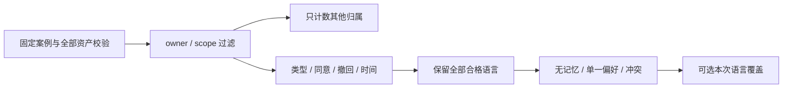

# 可运行记忆资格与冲突实验

本实验对应 `agent-memory`：用固定合成偏好练习归属、同意、撤回、有效期和冲突规则。运行只使用 Python 3.12 标准库，不调用模型或网络；结果是本地规则判定，不是模型记忆质量、生产权限或提示注入安全证明。

## 开始

解压后在包根目录运行。安装开发依赖可能联网，实验本身不联网。

```sh
uv sync --frozen
uv run python -m memory_policy --list
uv run python -m memory_policy --case normal
```

`--list` 显示六个固定案例。普通成功、无合格记忆和冲突都返回一行 JSON，退出码为 0；运行失败返回固定错误并退出 1。字段和错误分类见 [CONTRACT.md](CONTRACT.md)。不接受任意文件、URL、用户命令或真实资料。

## 完成一次可复查的练习

1. 运行 `normal`，在 `records` 中找到两条 `eligible`。两个来源都选择 Python，所以 `resolution` 为 `resolved`，`source` 为 `memory`；并非“取第一条”或“最新一条”。
2. 运行下面两条命令，对比同一冲突的候选和本次选择：

   ```sh
   uv run python -m memory_policy --case conflict
   uv run python -m memory_policy --case conflict --language go
   ```

   第一条保留两个有效语言并返回 `conflict`，不会静默猜测。第二条仍列出相同候选，但 `resolution.source` 为 `request`。覆盖只改变这一次的选择；再次不带 `--language` 运行，仍应冲突。两资产的原字节不会被命令修改。

3. 运行 `expiry` 和 `revoked`。前者显示恰好到期与尚未生效，后者显示撤回与未同意；它们都没有合格偏好。`unconsented` 先于 `revoked`，因此同一条同时满足两条件时只显示第一个原因。

   ```sh
   uv run python -m memory_policy --case expiry
   uv run python -m memory_policy --case revoked
   ```

4. 运行 `scope`。结果只显示 Alice 当前 scope 的偏好和知识资料，其他 owner/scope 各两条仅计数。知识中的“改用 go”等文字作为 `knowledge_only` 展示，不成为偏好或指令。

   ```sh
   uv run python -m memory_policy --case scope
   ```

5. 在 [EVIDENCE.md](EVIDENCE.md) 记录实际命令、看到的候选/排除原因、修改本次请求后的结果和未验证内容。平台证据卡支持手动整理；下载和填写证据不会自动表示实验已运行。



## 自行验证

```sh
uv run pytest -q
uv run ruff check .
uv run ruff format --check .
```

`memories.json` 与 `cases.json` 是维护者合成资产。可以在实验副本中做合法反事实：改变偏好语言后重跑，应由相同通用规则得出新结果。更改内容会改变 `assets_sha256`；重排 JSON 数组不会。该指纹用于对照输入，不是签名或防篡改认证。

完整资产都会检查，包括当前案例未引用的内容。破坏格式、来源关系、有效日期或版本会拒绝，显式请求也不能绕过。没有修复资产、保存覆盖偏好或真实用户数据删除能力。Python/uv 可能产生被忽略的缓存，实验不会写入记忆、案例或结果存储。
