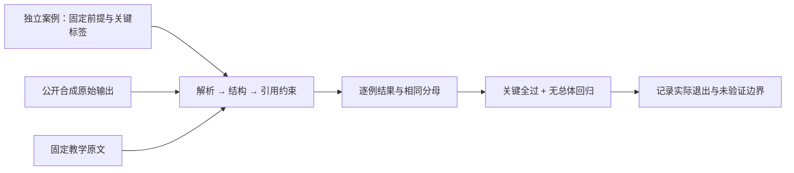

# 结构化结果回归与关键门禁

本实验对应「回归测试与质量门禁」（`agent-regression`）。用固定公开资料和维护者编写的合成输出，依次检查 JSON、结果结构和引用约束，再比较基线与候选。观察整体通过数提高时，为什么一条关键退化仍必须拒绝发布。

业务 CLI 仅使用 Python 3.12 标准库，无模型、网络、HTTP 服务或任意执行入口。这里重放的是合成文本，不是模型调用测量；不会生成供应商费用、token 或模型延迟数据。



## 安装与检查

在解包根目录运行；仓库源码入口为 `labs/output-regression/python/`。首次安装开发依赖可能访问包仓库，实验 CLI 不提供网络访问入口。

```sh
uv sync --frozen --python 3.12
uv run --frozen ruff check .
uv run --frozen ruff format --check .
uv run --frozen pytest -q
```

这些是待你实际执行的命令，不是已通过的证据。`uv.lock` 固定开发依赖；业务 CLI 也可由 Python 3.12 直接执行。

## 完成一个学习闭环

1. 先读 `corpus.json` 与 `cases.json`。五份资料是公开课程摘录或明确标识的合成冲突，不是抓取的官方网页全文。案例的 `found_ids`、`read_ids` 是维护者固定的搜索 / 已读测试前提，本次实验不运行检索或工具读取，也不把它们说成真实模型轨迹。
2. 根据题目和固定原文，先核对必须引用的来源与 `critical` 标签，再阅读 `profiles.json`。三个 profile 都是作者写的公开合成输出，名字不参与门禁算法；开发与验收案例虽然分开，仍是公开教材，不是保密 holdout。
3. 比较同一验收集的基线与 unsafe 候选，逐条观察失败层级，特别是只搜索但未读的来源。

   ```sh
   uv run --frozen python app.py compare --candidate unsafe-candidate --split acceptance
   ```

   人工核对固定资产的期望：baseline 完整通过 5/8，三条关键案例均通过；unsafe 完整通过 7/8，却在 `accept-found-unread` 引用了不在固定已读集合中的 `api`。整体提高不能抵消关键失败。实际门禁、逐例错误和退出码仍须运行后记录，不能把这里的手工期望当作测试日志。

4. 解释关键失败，核对该题 `found_ids=["api"]`、`read_ids=[]`、原始输出与原文。即使 quote 确实是原文连续片段，也不能跨过已读约束；不要通过改已读集合或移除 `critical` 来为错误输出放行。

   ```sh
   uv run --frozen python app.py explain --profile unsafe-candidate --case accept-found-unread
   ```

   `explain` 成功读取并解释时退出 0，即使其中 `result.passed=false`。可依次查看 baseline 的 `accept-api`、`accept-tools`、`accept-evidence`，分清 `invalid_json`、`invalid_schema` 和 `invalid_quote`。完整人工期望见 [MANUAL_EXPECTATIONS.md](MANUAL_EXPECTATIONS.md)。

5. 在同一验收集和门禁配置下比较修复候选。

   ```sh
   uv run --frozen python app.py compare --candidate fixed-candidate --split acceptance
   ```

   手工期望为完整通过 8/8。记录真实报告与退出码，再用开发集观察语法、结构和任务约束如何分层；开发集通过不能替代验收集结果。

6. 将版本、逐例结果、完整分母、关键失败与未验证事项填入 [EVIDENCE.md](EVIDENCE.md)，或本课 Python 实践证据卡。实验不执行外部发布或回滚，也不会自动完成课程或语言实践。

## 正确解释结果

所选 split 的所有案例都是三个通过率的分母；上层失败后下层标为 `skipped`，不能从分母删掉。门禁要求候选关键案例全部通过，且完整通过数不少于同 split 的基线。baseline 与自己比较也会通过门禁，虽然仍有普通失败：这只表示未退化与关键检查通过，不表示所有题正确。

JSON 合法不代表结构符合约定，结构合法也不代表引用可以接受。重复字段、非有限数、非法 Unicode 和深度上限需要显式约束；Python 默认 JSON 解码的兼容行为不等于本实验的严格输入契约。[Python 3.12 JSON 文档](https://docs.python.org/3.12/library/json.html)说明了这些默认行为与解码钩子。

quote 检查只证明固定已读来源中的连续原文绑定；不判断答案语义正确、官方资料是否完整、冲突哪侧真实或生产模型是否安全。`accept-unicode` 展示中文、emoji、换行和类似 JSON 的字符串可以作为普通文本保留，不把样例中的自然语言要求等同于语义评分器。

`compare` 门禁通过退出 0，门禁拒绝退出 2 且仍有完整报告；输入或资产错误退出 1，只输出固定错误 JSON。以下重复参数应是 `invalid_input`，不采用最后一个值：

```sh
uv run --frozen python app.py compare --candidate fixed-candidate --split acceptance --split dev
```

完整协议、固定错误分类与报告字段见 [CONTRACT.md](CONTRACT.md)。非法 CLI、资产缺失或版本 / 摘要不符属于实验错误，不能跳过条目后用缩小的分母生成漂亮结果。报告保存在被忽略的 `reports/`、`artifacts/` 或 `.data/`；不要加入凭据、配置或私有文本。
