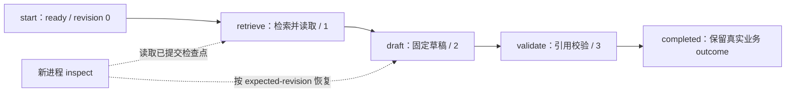

# 从检查点恢复研究流程

本实验对应「工作流与状态机」课。三个固定 Python 节点通过本地 SQLite 保存检查点：检索并实际读取 → 起草 → 引用校验。每条 CLI 命令是独立进程，学习者可以在提交前后中断，再启动新进程查看并恢复同一个 run。无需模型、账号或密钥，没有 HTTP、浏览器客户端、网页抓取或外部写操作。



## 冻结安装与第一次运行

需要 Python 3.12 和 uv。在解包根目录运行；仓库源码入口是 `labs/workflow-checkpoint/python/`。首次安装测试依赖可能需要网络，实验运行不访问网络。

```sh
uv sync --locked --python 3.12
uv run --frozen ruff check .
uv run --frozen ruff format --check .
uv run --frozen pytest -q
uv run --frozen python app.py start --run-id 11111111-1111-4111-8111-111111111111 --case normal
uv run --frozen python app.py step --run-id 11111111-1111-4111-8111-111111111111 --expected-revision 0
uv run --frozen python app.py inspect --run-id 11111111-1111-4111-8111-111111111111
uv run --frozen python app.py resume --run-id 11111111-1111-4111-8111-111111111111 --expected-revision 1
```

普通成功或拒绝通过 stdout 返回一个 JSON；故障注入退出或 stdout 已关闭时可能无法收到 JSON，应新进程 inspect 原 run 确认状态。数据库固定为当前目录的 `.data/checkpoints.sqlite3`，只有 `start` 可以创建或初始化。示例 UUID 是公开练习标识；再次使用相同 ID 会返回 `run_exists`，请 inspect 原运行，或为新的独立练习使用另一个规范小写 UUIDv4。不要为消除错误而覆盖已有数据库。

## 按顺序观察

1. 找到 revision 0 的 `ready`。第一次 step 只提交 retrieve，revision 变为 1；检查 `found_ids` 与 `read_documents`，搜索命中不等于已经读取。
2. resume 从明确的 revision 继续，最多提交剩余三个节点。检查最终引用的来源 ID、原文连续摘录、固定 URL，以及 outcome。`normal`、`empty`、`conflict` 分别演示有证据、证据不足、合成资料冲突；后两者不是存储错误，不能伪造一致结论。
3. 对完成的 run 使用 revision 3 再 resume。结果不变且 `performed=[]`；使用旧 revision 必须拒绝。`performed` 只记录本次已确认提交的节点，恢复时仍会重新计算固定期望来校验保存内容，不表示 CPU 函数从不重算。
4. 完成下面的提交前后故障练习。先 inspect 原 run 判断已提交进度，再恢复，不能根据上一条命令没有输出就认定“没有提交”。
5. 运行 `test_process.py` 中的真实重启、持锁 SIGKILL 和两个进程竞争验收。不同进程争同一 expected revision 只能有一个提交，另一个明确冲突；不用短 sleep 猜测谁先到达。
6. 把实际版本、完整命令、退出码、PID、检查点变化和引用写入 [EVIDENCE.md](EVIDENCE.md) 或课程证据卡。下载与固定案例通过不会自动标记课程或 Python 实践完成。

## 提交前故障：旧检查点仍有效

```sh
uv run --frozen python app.py start --run-id 22222222-2222-4222-8222-222222222222 --case normal
uv run --frozen python app.py step --run-id 22222222-2222-4222-8222-222222222222 --expected-revision 0 --fault before-commit --fault-node retrieve
uv run --frozen python app.py inspect --run-id 22222222-2222-4222-8222-222222222222
uv run --frozen python app.py resume --run-id 22222222-2222-4222-8222-222222222222 --expected-revision 0
```

第二条故意在事务内写入后、COMMIT 前退出 70，没有成功 JSON。新进程应观察 revision 0；旧事务没有成为已提交检查点。以真实 inspect / 数据库证据为准，不能只根据退出码推断。

## 提交后故障：没有响应仍可能已经提交

```sh
uv run --frozen python app.py start --run-id 33333333-3333-4333-8333-333333333333 --case conflict
uv run --frozen python app.py step --run-id 33333333-3333-4333-8333-333333333333 --expected-revision 0 --fault after-commit --fault-node retrieve
uv run --frozen python app.py inspect --run-id 33333333-3333-4333-8333-333333333333
uv run --frozen python app.py resume --run-id 33333333-3333-4333-8333-333333333333 --expected-revision 1
```

第二条在 COMMIT 返回后、成功 stdout 前退出 71。新进程应观察 revision 1；恢复不追加第二条 retrieve 提交。`pause-before-commit` 则先发固定 `fault_reached` 事件，等待 2 秒后自行退出 72；这不是 SIGKILL 证据。真实 SIGKILL 测试必须由父进程等到该事件后，只杀死自己的子进程，再核对实际信号退出和新连接中的数据库状态。

## 边界

[CONTRACT.md](CONTRACT.md) 规定输出、版本、事务、引用和错误。`workflow.py` 是纯节点与严格校验，`repository.py` 保存检查点，`schema.sql` 定义固定结构，`fixtures.json` 是五份公开资料与三个固定案例；URL 仅作来源标注，不代表读取过网页。

只验证本地 SQLite 的提交边界、重复调用和进程重启。没有模型决策、生产认证、分布式调度、外部副作用 exactly-once、断电或硬件耐久性认证，也不允许任意命令、代码或自由文本工作流。损坏和不兼容状态明确拒绝，不自动修复。数据库、旁路文件、配置、日志和报告保留在忽略目录；平台只提供下载，不执行学习者修改后的代码。
